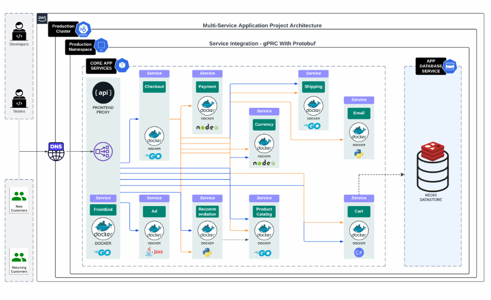
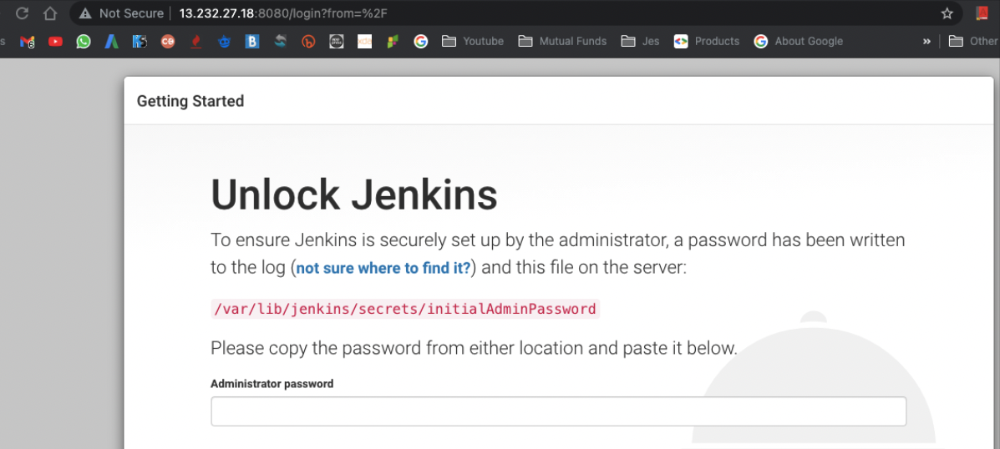
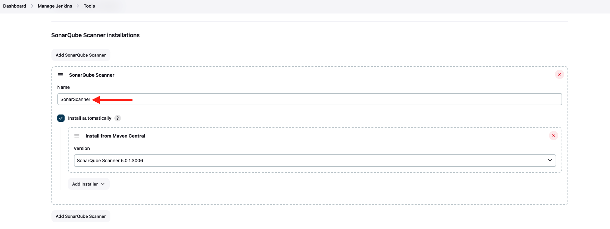
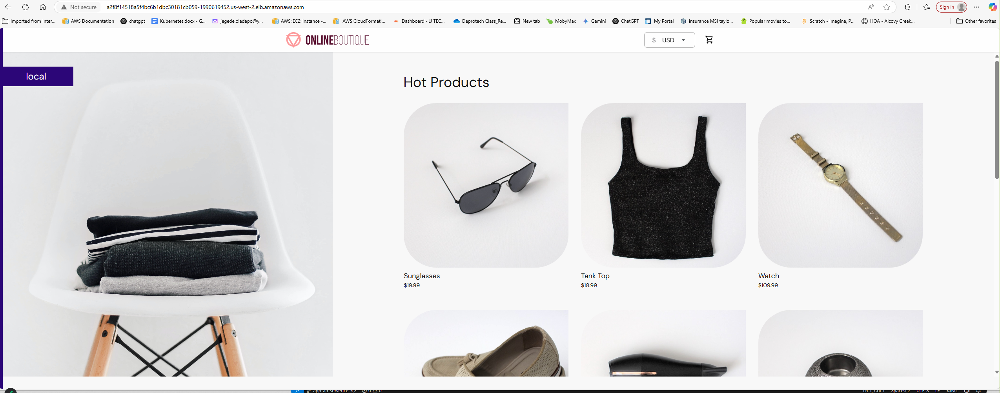

# Terraform CI/CD Infrastructure on AWS

This Terraform module provisions a complete CI/CD environment in AWS using the `us-west-2` region. The setup includes a VPC, public subnets, routing, EC2 instances for Jenkins, Prometheus, Grafana, and SonarQube, with security groups and IAM roles configured for access and automation.

### EKS CLUSTER
Cd into eks-cluster-ec2

terraform init
terraform plan
terraform apply

### this automatically setup your EKS cluster
EKS cluster

### CICD PIPELINE
Cd into main-cicd

terraform init
terraform plan
terraform apply

### this automatically setup your instances for
sonaqube
jenkins
prometheus
grafana

### The architectural diagram above illustrates a DevSecOps CI/CD infrastructure on AWS, enhanced with observability using Prometheus and Grafana. Here's a breakdown of each component and their interaction:

✅ Core Components & Flow
🏗️ Terraform-Based Provisioning infrastructure (EC2 instances, VPC, subnets, security groups)
☁️ AWS Cloud: The platform hosting all EC2 instances
🔁 CI/CD Pipeline (Orchestrated by Jenkins)
🧱 Jenkins
🧪 SonarQube: Used for SAST (Static Application Security Testing).
🛡 Snyk: Performs Software Composition Analysis (SCA) for dependency vulnerabilities.
🐳 Docker: Jenkins builds and tags Docker images for microservices.
📜 OPA/Conftest: Scans the Dockerfile for misconfigurations using policy-as-code
☸️ Kubernetes (EKS or self-managed): The target environment for application deployment.
🔍 Observability: Prometheus + Grafana 📊 Prometheus 📈 Grafana
📣 Notifications: Slack Integration is configured in Jenkins:

---
### Jenkins setup
1) #### Access Jenkins
    Copy your Jenkins Public IP Address and paste on the browser = ExternalIP:8080
    - Copy the Path from the Jenkins UI to get the Administrator Password
        - Make sure you're still logged into your Jenkins Instance
        - Run the command: `sudo cat /var/lib/jenkins/secrets/initialAdminPassword`
        - Copy the password and login to Jenkins

### Note:  Jenkins URL 

- **`NOTE:`** Copy the Outputed Password and Paste in the `Administrator password` in Jenkins
    - Plugins: Choose `Install Suggested Plugings` 
    - Provide 
        - Username: **`admin`**
        - Password: **`admin`**
        - `Name` and `Email` can also be admin. You can use `admin` all, as its a poc.
    - Click `Continue`
    - Click on `Start using Jenkins`

2)  #### Plugin installations:
    - Click on `Manage Jenkins`
    - Click on `Plugins`
    - Click `Available`
    - Search and Install the following Plugings and `"Install"`
        - **SonarQube Scanner**
        - **Snyk**
        - **Multibranch Scan Webhook Trigger**
        - **Eclipse Temurin installer**
        - **Pipeline: Stage View**
        - **Docker**
        - **Docker Commons**
        - **Docker Pipeline**
        - **docker-build-step**
        - **Docker API**
        - **Kubernetes**
        - **Kubernetes CLI**
        - **Kubernetes Credentials**
        - **Kubernetes Client API**
        - **Kubernetes Credentials Provider**
        - **Kubernetes :: Pipeline :: DevOps Steps**
        - **Slack Notification**
        - **ssh-agent**
        - **BlueOcean**
        - **Build Timestamp**
        - **Prometheus Metrics**
  
    - Click on `Install`
    - Once all plugins are installed
    - Select/Check the Box **`Restart Jenkins when installation is complete and no jobs are running`**

- Refresh your Browser and Log back into Jenkins
    - Once you log back into Jenkins

3)  #### Global tools configuration:
    - Click on Manage Jenkins -->> Global Tool Configuration
    - Click on tools -->> Global Tool Configuration

- **JDK** 
        - Click on `Add JDK` -->> Make sure **Install automatically** is enabled 
        
        **Note:** By default the **Install Oracle Java SE Development Kit from the website** make sure to close that option by clicking on the image as shown below.
        * Name: `JDK17`
        * Click on `Add installer`
        * Select `Install from adoptium.net` 
        * Version: **`jdk-17.0.8.1+1`**

- **Gradle Installation**
      - Click on `Add Gradle`
      - Name: `Gradle`
      - Enable `Install automatically`
      - Version: `8.8`

- **SonarQube Scanner** 
      - Click on `Add SonarQube Scanner` 
      - Name: `SonarScanner`
      - Enable: `Install automatically` 

- **Snyk Installations** 
      - Click on ``Add Snyk`
      - Name: `Snyk`
      - Enable: `Install automatically` 
        - Version: `latest`
        - Update policy interval (hours): `24`
        - OS platform architecture: `Auto-detection`

- **Docker installations** 
      - Click on `Add Docker` 
      - Name: `Docker`
      - Click on `Add installer`
        - Select `Download from docker.com`
        - Docker version: `latest`
      - Enable: `Install automatically` 

Apply and save

4)  #### Credentials setup(SonarQube, Slack, DockerHub, Kubernetes and ZAP):
    - Click on `Manage Jenkins`
      - Click on `Credentials`
      - Click on `Jenkins - System`
      - Click on `Global Credentials (Unrestricted)`
      - Click on `Add Credentials`
      1)  ##### SonarQube secret token (SonarQube-Token)
          - ###### Generating SonarQube secret token:
              - Login to your SonarQube Application (http://SonarServer-Sublic-IP:9000)
                - Default username: **`admin`** 
                - Default password: **`admin`**
            - Click on `Login`
                - Old Password: **`admin`**
                - New Password: **`adminadmin`**
                - Confirm Password: **`adminadmin`**

          ### click on administration and click on projects, management

              - Click on `create project` *(Create the `app-shipping-service` microservice test project)*
                - Project display name: `app-shipping-service`
                - Display key: `app-shipping-service`
                - Main branch name: `app-shipping-service` 
              
              - Click on `Projects` *(Create the `app-recommendation-service` microservice test project)*
                - Project display name: `app-recommendation-service`
                - Display key: `app-recommendation-service`
                - Main branch name: `app-recommendation-service` 
              
              - Click on `Projects` *(Create the `app-product-catalog-service` microservice test project)*
                - Project display name: `app-product-catalog-service`
                - Display key: `app-product-catalog-service`
                - Main branch name: `app-product-catalog-service` 
              
              - Click on `Projects` *(Create the `app-payment-service` microservice test project)*
                - Project display name: `app-payment-service`
                - Display key: `app-payment-service`
                - Main branch name: `app-payment-service` 
              
              - Click on `Projects` *(Create the `app-loadgenerator-service` microservice test project)*
                - Project display name: `app-loadgenerator-service`
                - Display key: `app-loadgenerator-service`
                - Main branch name: `app-loadgenerator-service` 
              
              - Click on `Projects` *(Create the `app-frontend-service` microservice test project)*
                - Project display name: `app-frontend-service`
                - Display key: `app-frontend-service`
                - Main branch name: `app-frontend-service`
              
              - Click on `Projects` *(Create the `app-email-service` microservice test project)*
                - Project display name: `app-email-service`
                - Display key: `app-email-service`
                - Main branch name: `app-email-service` 
              
              - Click on `Projects` *(Create the `app-database` microservice test project)*
                - Project display name: `app-database`
                - Display key: `app-database`
                - Main branch name: `app-database` 
              
              - Click on `Projects` *(Create the `app-currency-service` microservice test project)*
                - Project display name: `app-currency-service`
                - Display key: `app-currency-service`
                - Main branch name: `app-currency-service` 
              
              - Click on `Projects` *(Create the `app-checkout-service` microservice test project)*
                - Project display name: `app-checkout-service`
                - Display key: `app-checkout-service`
                - Main branch name: `app-checkout-service` 
              
              - Click on `Projects` *(Create the `app-cart-service` microservice test project)*
                - Project display name: `app-cart-service`
                - Display key: `app-cart-service`
                - Main branch name: `app-cart-service` 
              
              - Click on `Projects` *(Create the `app-ad-serverice` microservice test project)*
                - Project display name: `app-ad-serverice`
                - Display key: `app-ad-serverice`
                - Main branch name: `app-ad-serverice` 
              - Click on `Set Up`

            - Generate a `Global Analysis Token`    *This is the Token you need for Authorization*
              - Click on the `User Profile / Administrator` icon at top right of SonarQube
              - Click on `My Account`
              - Click `Security`
              - `Generate Token:`   *Generate this TOKEN and Use in the Next Step to Create The SonarQube Credential* 
                - Name: `microservices-web-app-token`
                - Type: `Global Analysis Token`
                - Expires in: `30 days`
              - Click on `GENERATE`
              - NOTE: *`Save The Token Somewhere...`*   sqa_b39f9ce5e1312fe46ffc512f87b520726182e2c4

          - ###### Store Credentials:
              - Navigate back to Jenkins http://JENKINS_PUBLIC_IP:8080
              - Click on `Manage Jenkins` 
                - Click on `Jenkins System`
                - Click `Global credentials (unrestricted)`

          - ###### Store SonarQube Secret Token in Jenkins:     
              - Click on ``Add Credentials``
              - Kind: `Secret text`
              - Secret: `Paste the SonarQube TOKEN` value that we have created on the SonarQube server
              - ID: ``SonarQube-Credential``
              - Description: `SonarQube-Credential`
              - Click on `Create`

      2)  ##### Slack secret token (slack-token)
          - ###### Get The Slack Token: 
              - Slack: https://join.slack.com/t/jjtechtowerba-zuj7343/shared_invite/zt-24mgawshy-EhixQsRyVuCo8UD~AbhQYQ
              - Navigate to the Slack "Channel you created": `YOUR_INITIAL-devsecops-cicd-alerts`
              - Click on your `Channel Drop Down`
              - Click on `Integrations` and Click on `Add an App`
              - Click on `Jenkins CI VIEW` and Click on `Configuration`
              - Click on `Add to Slack`, Click on the Drop Down and `Select your Channel`
              - Click on `Add Jenkins CI Integration`
              - **`NOTE:`** *The TOKEN is on Step 3*

          - ###### Create The Slack Credential For Jenkins:
              - Click on ``Add Credentials``
                - Click on `Jenkins System`
                - Click `Global credentials (unrestricted)`
              - Kind: Secret text            
              - Secret: Place the Integration Token Credential ID (Note: Generate for slack setup)
              - ID: ``Slack-Credential``
              - Description: `Slack-Credential`
              - Click on `Create`  

3)  ##### DockerHub Credential (Username and Password)
      - ###### Login to Your DockerHub Account (You can CREATE one if you Don't have an Account)
      - Access DockerHub at: https://hub.docker.com/
              - Provide Username: `YOUR USERNAME`
              - Provide Username: `YOUR PASSWORD`
              - Click on `Sign In` or `Sign Up`    
                - **NOTE:** *If you have an account `Sign in` If not `Sign up`*

          - ###### DockerHub Credential (Username and Password)
	          - Click on ``Add Credentials``
                - Click on `Jenkins System`
                - Click `Global credentials (unrestricted)`
	          - Kind: Username with password                  
	          - Username: ``YOUR USERNAME``
	          - Password: ``YOUR PASSWORD``
	          - ID: ``DockerHub-Credential``
	          - Description: `DockerHub-Credential`
	          - Click on `Create`   

        - ###### Get Cluster Credential From Kube Config
            - `SSH` back into your `Jenkins-CI` server
            ###  aws configure
            - RUN the command: `aws eks update-kubeconfig --name <clustername> --region <region>`
            ###### aws eks update-kubeconfig --name online-shop-eks-cluster --region us-west-2
            - COPY the Cluster KubeConfig: `cat ~/.kube/config`
            - `COPY` the KubeConfig file content
                - You can use your `Notepad` or any other `Text Editor` as well
                - Open your Local `GitBash` or `Terminal`
                - Create a File Locally
                - RUN: `rm ~/Downloads/kubeconfig-secret.txt`
                - RUN: `touch ~/Downloads/kubeconfig-secret.txt`
                - RUN: `vi ~/Downloads/kubeconfig-secret.txt`
                - `PASTE` and `SAVE` the KubeConfig content in the file

         - ###### Create The Kubernetes Credential In Jenkins
            - Navigate back to Jenkins
            - Click on ``Add Credentials``
                - Click on `Jenkins System`
                - Click `Global credentials (unrestricted)`
            - Kind: `Secret File`          
            - File: Click ``Choose File``
                - **NOTE:** *Seletct the KubeConfig file you saved locally*
            - ID: ``Kubernetes-Credential``
            - Description: `Kubernetes-Credential`
            - Click on `Create`  

            - ###### Create The aws key and secret access key
            - Navigate back to Jenkins
            - Click on ``Add Credentials``
                - Click on `Jenkins System`
                - Click `Global credentials (unrestricted)`
            - Kind:  Username with password
            - Username: Your AWS Access Key ID
            - Password: Your AWS Secret Access Key
            - ID: aws-credentials (or any ID you'll reference in the pipeline)
            - Description: AWS credentials for accessing EKS
            
      5) ##### Create the ZAP Dynamic Application Security Testing Server Credential
         - ###### Start by Copy the `EC2 SSH Private Key File Content` of your `Jenkins-CI` Server
            - Open your `GitBash Terminal` or `MacOS Terminal` 
            - Navigate to the Location where your `Jenkins-CI` Server SSH Key is Stored *(Usually in **Downloads**)*
            - Run the Command `cat /Your_Key_PATH/YOUR_SSH_KEY_FILE_NAME.pem`
              - `Note:` Your `.pem` private key will most like be in `Downloads`
            - COPY the KEY content and Navigate back to Jenkins to store it...
        
         - ###### Create The ZAP Server SSH Key Credential in Jenkins
            - Navigate to the `Jenkins Global Credential Dash`
            - Click on `Create Credentials`
            - Scope: Select `Global......`
            - Type: Select `SSH Username with Private Key`
            - ID and Description: `OWASP-Zap-Credential`
            - Username: `ubuntu`
            - Private key: Select
              - Key: Click on `Add`
              - Key: `Paste The Private Key Content You Copied`
            - Click on `Create`
      
      6) ##### Create Your Snyk Test (SCA) Credential
         - ###### Navigate to: https://snyk.com/
            - Click on `Sign Up`
            - Select `GitHub`
                - *Once you're login to your **Snyk** account*
            - Click on `Your Name` below `Help` on the Botton left hand side of your Snyk Account
            - Click on `Account Settings`
            - Auth Token (KEY): Click on `Click To Show`
            - **COPY** the TOKEN and SAVE somewhere
        

        - ###### Create SNYK Credential in Jenkins
            - Click on ``Add Credentials``
            - Kind: `Secret text`
            - Secret: `Paste the SNYK TOKEN` 
            - ID: ``Snyk-API-Token``
            - Description: `Snyk-API-Token`
            - Click on `Create`

3)  #### Configure system:    
    1)  - Click on ``Manage Jenkins`` 
        - Click on ``System`` and navigate to the `SonarQube Servers` section
        - Click on Add `SonarQube`
        - Name: `Sonar-Server`
        - Server URL: http://<SONARQUBE_SERVER_IP>:9000
        - Server authentication token: Select `SonarQube-Credential`

    2)  - Still on `Manage Jenkins` and `Configure System`
        - Scroll down to the `Slack` Section (at the very bottom)
        - Go to section `Slack`
            - `NOTE:` *Make sure you still have the Slack Page that has the `team subdomain` & `integration token` open*
            - Workspace: **Provide the `Team Subdomain` value** (created above)
            - Credentials: select the `Slack-Credential` credentials (created above) 
            - Default channel / member id: `#PROVIDE_YOUR_CHANNEL_NAME_HERE`
            - Click on `Test Connection`
            - Click on `Apply` and `Save`

4) ### 🛠 Step 1: Configure Prometheus to Scrape Metrics

Update the prometheus.yml config file on the Prometheus EC2 instance:
### path /etc/prometheus/prometheus.yml
scrape_configs:
  - job_name: 'jenkins'
    metrics_path: /prometheus
    static_configs:
      - targets: ['<jenkins-ec2-ip>:8080']

Save and restart Prometheus:
sudo systemctl restart prometheus
systemctl status prometheus
Verify via Prometheus UI under Status > Targets
- targets: ['<prometheus-ec2-ip>:9090/targets']

### 🛠 Step 2: Connect Prometheus as Data Source in Grafana
     - Log in to Grafana UI
     - Navigate to Settings > Data Sources
     - Click Add Data Source
     - Select Prometheus
     - Configure:
     - URL: http://<prometheus-ec2-ip>:9090
     - Click Save & Test

### 📊 Step 3: Import Dashboards
     - In Grafana, click + > Import
     - Use a popular dashboard ID:
     - Jenkins (ID: 9964)
     - Set Prometheus as the data source
     - Click Import

### 🚨 Step 4: Set Up Alerts  (optional)
   - Grafana Alerts
   - In Grafana, go to Alerting > Contact Points
   - Add email, Slack, or webhook as a contact point
   - Create an Alert Rule (e.g., high CPU on Jenkins or failed jobs)
   - Assign to dashboard panels

### Pipeline creation (Make Sure To Make The Following Updates First)
- UPDATE YOUR ``Jenkinsfiles...``

- Update your `Frontend Service` - `OWASP Zap Server IP` and `EKS Worker Node IP` in the `Jenkinsfile` on `Line 100`
  - `NOTE` to update the `Frontend Service`, you must `Switch` to the `Frontend Branch`
- Update the `EKS Worker Node IP` with yours in the `Jenkinsfile` on `Line 100`
<!-- sh 'ssh -o StrictHostKeyChecking=no ubuntu@35.90.100.75 "docker run -t zaproxy/zap-weekly zap-baseline.py -t http://44.244.36.98:30000/" || true' -->

- Update your `Slack Channel Name` in the `Jenkinsfiles...` - `All Microservices` on `Line 126`
<!-- slackSend channel: '#all-minecraftapp', -->

- Update `SonarQube projectName` of your Microservices in the `Jenkinsfiles...` - `All Microservices`
- Update the `SonarQube projectKey` of your Microservices in the `Jenkinsfiles...` - `All Microservices`
- Update the `DockerHub username` of your Microservices in the `Jenkinsfiles...` - `All Microservices`, provide Yours
- Update the `DockerHub username/Image name` in all the `deployment.yaml` files for the different environments `test-env` and `prod-env` folders across `Every Single Microservice Branch`
    
    - Log into Jenkins: http://Jenkins-Public-IP:8080/
    - Click on `New Item`
    - Enter an item name: `Online-Shop-Microservices-CICD-Automation` 
    - Select the category as **`Multibranch Pipeline`**
    - Click `OK`
    - BRANCH SOURCES:
      - Git:
        - Project Repository
          - Repository URL: `Provide Your microservices Project Repo Git URL` 
    - BEHAVIORS
      - Set it to: `Discover Branches` and
      - Click `Add`
        - Select: `Filter by name (with wildcards)`
        - Include: `app-*`
    - Property strategy: `All branches get the same properties`
    - BUILD CONFIGURATION
      - Mode: Select `by Jenkinsfile`
      - Script Path: `Jenkinsfile`
    - SCAN MULTIBRANCH PIPELINE TRIGGER
      - Select `Scan by webhook`
      - Trigger token: `automation`
    - Click on `Apply` and `Save`
    
    - CONFIGURE MULTIBRANCH PIPELINE WEBHOOK
      - Copy this URL and Update the Jenkins IP (to yours): `http://PROVIDE_YOUR_JENKINS_IP:8080/multibranch-webhook-trigger/invoke?token=automation`

      - Navigate to your `Project Repository`
        - Click on `Settings` in the Repository
        - Click on `Webhooks`
        - Click on `Add Webhook`
        - Payload URL: `http://PROVIDE_YOUR_JENKINS_IP:8080/multibranch-webhook-trigger/invoke?token=automation`
        - Content type: `application/json`
        - Which events would you like to trigger this webhook: Select `Just the push event`
        - Enable `Active`
        - Click `ADD WEBHOOK`

### Navigate Back To Jenkins and Confirm That All 12 Pipeline Jobs Are Running (11 Microservices Jobs and 1 DB Job)
  - Click on the `Jenkins Pipeline Job Name`
  - Click on `Scan Multibranch Pipeline Now`

### Confirm That All Microservices Branch Pipelines Succeeded (If Not, Troubleshoot)

### SonarQube Code Inspection Result For All Microservices Source Code
  

### Also Confirm You Have All Service Deployment/Docker Artifacts In DockerHub

### PERFORM THE DEPLOYMENT IN THE STAGING ENVIRONMENT/NAMESPACE (EKS CLUSTER)
- To perform the DEPLOYMENT in the staging Envrionment 
- You Just Have To `UNCOMMENT` the `DEPLOY STAGE` in the `Jenkinsfiles.....` and `PUSH` to GitHub
- DEPLOY the Microservices in the STAGING Environment in the following ORDER (To Resolve DEPENDENCIES around the SERVICES)

1. *`Redis DB`*
2. *`Product Catalog Service`*
3. *`Email Service`*
4. *`Currency Service`*
5. *`Payment Service`*
6. *`Shipping Service`*
7. *`Cart Service`*
8. *`Ad Service`*
9. *`Recommendation Service`*
10. *`Checkout Service`*
11. *`Frontend`*
12. *`Load Generator`*

  ### A. Test Application Access From the `Test/Stagging-Environment` Using `NodePort` of one of your Workers
  - SSH Back into your `Jenkins-CI` Server
      - RUN: `kubectl get svc -n test-env`
      - **NOTE:** COPY the Exposed `NodePort Port Number`
  

  - Access The Application Running in the `Test Environment` within the Cluster
  - `Update` the EKS Cluster Security Group ***(If you've not already)***
    - To do this, navigate to `EC2`
    - Select one of the `Worker Nodes` --> Click on `Security` --> Click on `The Security Group ID`
    - Click on `Edit Inbound Rules`: Port = `30000` and Source `0.0.0.0/0`
  - Open your Browser
  - Go to: http://YOUR_KUBERNETES_WORKER_NODE_IP:30000
  
  - Stage Deployment Succeeded

### PERFORM THE DEPLOYMENT NOW TO THE PRODUCTION ENVIRONMENT/NAMESPACE (EKS CLUSTER)
- To perform the DEPLOYMENT to the Prod Envrionment 
- You Just Have To `UNCOMMENT` the `DEPLOY STAGE` in the `Jenkinsfiles.....` and `PUSH` to GitHub
- DEPLOY the Microservices to the Prod Environment in the following ORDER (To Resolve DEPENDENCIES around the SERVICES)

1. *`Redis DB`*
2. *`Product Catalog Service`*
3. *`Email Service`*
4. *`Currency Service`*
5. *`Payment Service`*
6. *`Shipping Service`*
7. *`Cart Service`*
8. *`Ad Service`*
9. *`Recommendation Service`*
10. *`Checkout Service`*
11. *`Frontend`*
12. *`Load Generator`*

  - Confirm That Your Production Deployment Succeeded
   
      - To access the application running in the `Prod-Env`
      - Navigate back to the `Jenkins-CI` shell 
      - RUN: `kubectl get svc -n prod-env`
      - Copy the LoadBalancer DNS and Open on a TAB on your choice Browser http://PROD_LOADBALANCER_DNS
      

  - Snyk SCA Test Result
  

  - Test/Scan Dockerfiles with Open Policy Agent (OPA)
  

  - Slack Continuous Feedback Alert
  

### Congratulations Your Deployment Was Successful
